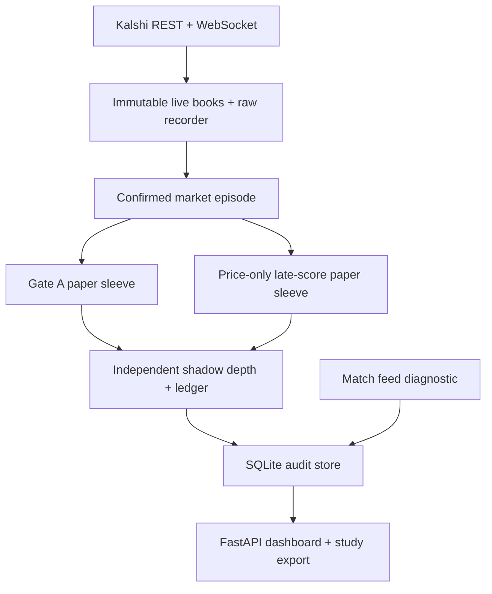

# ⚽ Football-Bot — Late-Game Sniper

A Kalshi **paper-trading engine + live mission-control dashboard** for the late-game
soccer microstructure study: when one leg of a match's Home/Draw/Away triplet sweeps
the book, its sibling confirms, and
the rest of the market takes hundreds of milliseconds to finish repricing. This bot
detects that first sweep, requires sibling confirmation, and paper-buys the remaining
underreaction against the **live recorded order book** — measuring exactly what a real
order would have gotten.

Built from a 2,377-event backtest over the entire history of Kalshi soccer markets
(all 10.5 weeks of it), with a pre-registered out-of-sample holdout pass
(95% CI on net-per-fill [+$1.28, +$5.76], P(no edge)=0.0005). That historical result
does not guarantee future performance. Paper first. Always.

## What it does

- **Discovers** every in-play soccer match across ~46 leagues on Kalshi (REST, every 3 min)
- **Subscribes** to `orderbook_delta` + `trade` + lifecycle WebSocket channels for markets near close
- **Records** the entire raw feed to hourly gzip segments (`DATA_DIR/raw/`) — the research goldmine
  that later replaces backtest fill assumptions with true book-at-arrival replays
- **Detects** the frozen Gate-A signal: ≥0.8 log-odds sweep, ≥5 levels, ≥200 contracts,
  sibling leg confirming within ±50ms with opposite sign
- **Paper-executes** IOC entries against the live book with a hard ~58¢ price cap
  (the isotonic zero-crossing), exits at target/timeout/settlement, verified Kalshi fees
- **Tracks kill conditions** from the research memo: live EV confidence interval,
  fill-model-vs-reality, feed latency p95, per-league rolling edge
- **Measures goal-feed latency** without affecting trading: batches Kalshi milestone
  score polls and timestamps numeric score changes beside received book/trade changes
- **Independently paper-tests Gate A and a late-score sleeve**: each gets its own admission,
  lockout, positions, exits, P&L, and counterfactual shadow liquidity
- **Infers possible late +1/equalizer transitions from prices alone**: normalizes the
  Home/Draw/Away triplet, rejects incoherent one-leg moves, and manages reversion with
  fee-aware scratch, trailing-profit, reversal, oscillation, and short-timeout exits
- **Auditable dashboard**: human match/contract names, exact UTC timing, normalized event
  diagnostics, two sleeve ledgers/P&Ls, latency and exit charts, persistent health/errors,
  phone-safe layouts, and a protected downloadable research bundle

**No credentials? DEMO mode** auto-starts: it replays the real Espanyol–Real Madrid
tape (Aug 22, 2026 — the 90'+ winner that started this project) through the exact same
pipeline with synthetic books, so the dashboard runs hot out of the box.

## Deploy on Railway

1. Push this repo to GitHub (`Football-Bot`), then in Railway: **New Project → Deploy from GitHub repo**
2. Railway auto-detects the Dockerfile. Add a **Volume** (e.g. mount at `/srv/data`) and set `DATA_DIR=/srv/data`
3. (Live mode) Set environment variables:
   - `KALSHI_API_KEY_ID` — from kalshi.com → Account & security → API Keys
   - `KALSHI_PRIVATE_KEY` — paste the full PEM (multiline values are supported)
4. Generate a domain (Settings → Networking) and open it. Green LIVE badge = connected.

Leave the credentials empty to run the demo. `MODE=demo` forces demo even with keys.

### Credential security

- The private key is used **only** to sign Kalshi requests (RSA-PSS), read-only usage:
  no order endpoints are called anywhere in this codebase (`grep -r portfolio app/` → nothing)
- Never commit `.env` / `.key` files (gitignored); rotate the key at kalshi.com anytime

## Local run

```bash
pip install -r requirements.txt
uvicorn app.main:app --port 8080
# open http://localhost:8080  → demo mode
```

## Configuration

Every strategy parameter is an env var (see `.env.example`). The defaults are the
**frozen Gate-A primary config** — change them consciously; the backtest CI applies
to the defaults. Notable ones:

| Var | Default | Meaning |
|---|---|---|
| `PRICE_CAP` | 58 | max cents paid per contract (isotonic zero-crossing) |
| `NOTIONAL_USD` | 100 | paper size per trade |
| `CONF_MS` / `CONF_SIGN` | 50 / true | sibling confirmation window / opposite-sign requirement |
| `LATE_ONLY` | false | trade only within `LATE_WINDOW_MIN` of scheduled close |
| `USE_STOP` | false | stops off per Gate A forensics (shadow-stop is always recorded) |
| `PRICE_ONLY_SLEEVE_MODE` | off | `parallel` paper-tests both sleeves independently; `enforce` runs only price-only |
| `PAPER_EXECUTION_V2` | false | opt into latency-aware paper arrivals, shadow liquidity, and entry/exit depth walking |
| `GOAL_LATENCY_OBSERVER` | true | read-only Kalshi score-vs-market arrival experiment; never enters the signal path |
| `GOAL_LATENCY_POLL_MS` | 250 | target interval for batched score polling; actual uncertainty is saved per observation |
| `EVENT_MATCH_WINDOW_S` | 90 | fixed ±seconds for diagnostic signal/event consistency matching; raised from 20 because the score feed lands 10-40 s after the market moves. Excluded from the strategy identity |
| `PAPER_MAX_BOOK_AGE_MS` | 0 | max age of the book a paper entry may fill against. **0 = record only**; above zero an older book refuses the entry as `stale_book`. A strategy parameter: it changes `config_id` |
| `PATH_THIN_AFTER_S` / `PATH_THIN_INTERVAL_MS` | 10 / 250 | forward/execution path sampling: every change for the first N seconds, then one row per interval, with every new peak and trough always kept |
| `SUBTHRESHOLD_CAPTURE` | true | record bursts below the Gate-A floor as research observations |
| `SUBTHRESHOLD_DL_MIN` / `_LEVELS_MIN` / `_SIZE_MIN` | 0.3 / 3 / 50 | the research floor those observations must clear |
| `PROVIDER_EVENT_FLUSH_S` | 60 | how often already-recorded provider events have their "last seen at" refreshed, in one batched transaction |
| `ADMIN_TOKEN` | empty | required `X-Admin-Token` for kill, flatten, and study export; empty fails closed |

Recorder health is exposed at `/api/status` under `recorder`. A write failure
marks it unhealthy, records the last error/failure count, alerts the dashboard,
and retries on later messages instead of silently losing the raw feed.

### Raw feed frames and the feed-health ledger

The socket is split into a reader that only receives and stamps frames and a
consumer that parses and routes them, so a recorded timestamp is the moment the
frame **arrived** rather than the moment it was processed. Each line of a raw
gzip segment is:

| key | meaning |
|---|---|
| `at` / `am` | arrival wall and monotonic clock, stamped by the reader on receipt |
| `lt` / `lm` | processing wall and monotonic clock, stamped when the consumer dequeued it (the original meaning of these keys, unchanged) |
| `bl` | frames still queued behind this one — the measured processing backlog |
| `m` | the exchange message |

`at`/`am`/`bl` are omitted when unknown, so older readers and older segments
stay valid. `lt - at` is the delay a frame suffered; before this existed that
delay was silently folded into every timestamp derived from the frame.

`feed_events` is the ledger of everything that interrupts the feed —
`connected`, `disconnected`, `subscribed`, `resubscribed`, `gap`,
`snapshot_requested`, `snapshot_complete`, `market_added`, `market_dropped`,
`recorder_rotate` — readable at `/api/feed-events` and included in the study
export. The same events are also written into the raw stream as
`{"type": "recorder_marker", "kind": ..., "detail": ...}` frames, so a segment
explains its own discontinuities without needing the database. `/api/status`
reports the live queue depth as `feed_backlog`, and the `backlog_frames`
latency series records the deepest queue seen in each 5 s window.

Every signal row (**every** outcome, including `subthreshold` and
`unconfirmed`) carries a `context` JSON column with `feed_lag_ms` (arrival minus
the exchange stamp), `proc_lag_ms` (processing minus arrival) and `backlog` for
the frame the burst was observed on. In demo mode `feed_lag_ms` is the replay
offset from the recorded tape's original timestamps, not a live measurement.

### What a captured row now answers

| Column | Where | Answers |
|---|---|---|
| `signals.context.books` | every signal row | what every leg of the match was quoting at the decision — bid, ask, sizes, last, mid |
| `signals.context.spread_c` | every signal row | how wide the candidate's own leg was |
| `signals.context.fillable` | every signal row | **what a Gate-A entry would have filled at** — `{vwap, qty, levels}` from walking the asks to `PRICE_CAP` for `NOTIONAL_USD`, without consuming anything. A declined or unconfirmed signal therefore carries the trade it refused |
| `signals.context.confirmation` | every signal row | the sibling bursts the confirmation scan weighed — `{sibling_ticker, lag_ms, signed_dl, levels, in_window, opposite_sign}` — so `unconfirmed` (76% of the funnel, 1,150 of 1,511 rows) says *why* |
| `signals.context.load` | every signal row | open forward watches, open positions and pending candidates at the decision |
| `signals.episode_id` | every signal row of one episode | `<market>:<candidate ts_ms>`, so the two rows `parallel` mode writes for one episode join without heuristics |
| `trades.entry_context` | every entry fill | `book_exchange_ts_ms`, `book_age_ms` (fill wall minus book arrival), `book_exchange_lag_ms` (fill wall minus exchange stamp), and the feed lag/backlog at the fill — **a fill taken from a 16 s-old book is labelled as such** |
| `trades.exit_context.exit_trigger` | every exit fill | the numbers behind the label: reason, observed bid, `elapsed_s`, the executable peak, and the computed scratch level for a sleeve exit |
| `trades.exit_context.book` | every exit fill | held-side and opposite-side top-8 at the fill, with `book_source` saying whether that is the fill book or the last one seen |
| `markets.result` / `settled_ts` / `last_yes_bid` / `last_yes_ask` | every watched market | how the market actually resolved — including the ones the bot **declined**, so the declined population has an outcome label |
| `goal_latency_observations.poll_seq`, `match_clock_observations.poll_seq` | every observation | which poll produced it, so poll cadence is reconstructible |

Rows written before a column existed keep `NULL`. Nothing is backfilled: an
unrecorded condition stays unrecorded rather than being given a plausible value.
In demo mode `book_exchange_lag_ms` carries the same caveat as `feed_lag_ms` —
it is the replay offset from the tape's original timestamps.

### Realistic paper execution (opt-in)

Set `PAPER_EXECUTION_V2=true` to route confirmed signals through the isolated V2
paper adapter. The detector, Gate-A thresholds, sibling confirmation, price cap,
notional, target, stop, and timeout rules remain unchanged. Only fill mechanics
change: orders reach the latest valid book after configurable latency, consume a
counterfactual shadow book, retain partial exit remainders, and record the actual
volume-weighted average price across every level walked. The live Kalshi book is
never mutated. Turning the flag off restores the original immediate paper desk.

V2 also persists every entry/exit level and fee in `paper_fills`, commits the
signal result and trade atomically, retries database failures without losing
paper depth, resumes partial stop/timeout/flatten exits, and restores open paper
positions after restart. Live fee type/multiplier metadata comes from Kalshi's
`/series/{series_ticker}` endpoint. Taker fills support both `quadratic` and
`quadratic_with_maker_fees`; V2 never posts maker orders, so maker fees are not
simulated. An unknown or unsupported schedule is recorded as `unsupported_fee`
instead of guessing profitability. K1 verifies
fills against the saved arrival book after 25 fills, K2 cannot pass before 50
confirmed signals, and K4 measures total signal-to-paper-arrival latency.

### Price-only late-score sleeve

Set `PRICE_ONLY_SLEEVE_MODE=parallel` and `PAPER_EXECUTION_V2=true` to paper-test
Gate A and the new sleeve independently with realistic fills. Use `enforce` only when
you intentionally want to suppress Gate A. The new sleeve never reads a score, goal, VAR, penalty,
or other match-event feed. Admission is gated on the persisted provider **match
clock** (period, minute and status only, never a score or event), which must be
mapped, fresh within `MATCH_CLOCK_MAX_AGE_MS`, and reading minute 88 or later.
A candidate whose clock is missing, stale or pre-88 fails closed and is recorded
with the reason. `SLEEVE_START_BEFORE_EXPIRY_MIN` / `SLEEVE_AFTER_EXPIRY_MIN`
describe a *schedule proxy* derived from `expected_expiration_time` that is
reported per signal as a diagnostic; they do not admit or reject a trade.

For each complete 1X2 market, the sleeve converts executable midpoints into a
normalized state vector:

`q_i(t) = midpoint_i(t) / sum_j midpoint_j(t)`

A rising team leg is labeled a *latent +1 transition*; a rising draw leg is labeled
a *latent equalizer*. Entry still requires the frozen Gate-A sweep and sibling
confirmation, plus a sufficiently large normalized gain, a sufficiently strong
post-state, no materially rising sibling, and at least 85% of the target gain
explained by probability leaving the other two legs. Ambiguous/missing triplets,
wide books, missing baselines, and negative sweeps fail closed. These are market
state inferences, not claims that the score was observed.

After entry, exits use executable bids. Once maximum favorable excursion is large
enough, the sleeve estimates round-trip taker fees per contract and scratches on a
return toward that break-even level. A larger move arms a trailing-profit exit.
Rapid full reversion exits as `sleeve_reversal`; oscillatory paths, profit decay,
and a 30-second hold limit also flatten through the latency-aware depth walker.
Because exit latency, spread gaps, and disappearing liquidity exist, a scratch
trigger cannot guarantee a no-loss fill.

The numeric defaults are deliberately bootstrap parameters, not an optimized edge.
Every decision stores its normalized triplet features in `signals.detail`, every
fill/fee/exit is stored in the paper ledger, and the raw feed is already retained for
counterfactual replay. Reconfiguration should be done only with event-grouped,
chronological walk-forward evaluation: fit on earlier matches, choose the candidate
with the best lower event-clustered 95% confidence bound after fees and latency, then
promote it only if an untouched later-match holdout is also positive with at least 50
independent events and acceptable drawdown/tail loss. Do not let live observations
continuously retune the active thresholds; use frozen champion/challenger versions
so the holdout remains meaningful.

### Configuration identity

Every signal and trade carries a `config_id`: a content address over the
strategy parameters **and** the contents of the strategy source files. The
`config_versions` table resolves each id back to those parameters and a code
fingerprint, and the export manifest names the identity that produced the run.

This exists because an aggregate over a mixture answers nothing. The first live
study reported one net of -$609.02 over 56 closed trades, which was really two
configurations pooled: 27 trades at -$630.13 and 29 at +$21.11, with gross per
contract moving from -3.98¢ to +2.39¢ between them. Code is part of the identity
because those two eras ran the same environment variables and different code.
Rows written before this existed keep a `NULL` config_id: unknown provenance is
preserved as unknown, never backfilled.

Never pool rows with different `config_id` values into one result.

### Sub-threshold research capture

The detector only ever recorded bursts that crossed the trading floor, so the
population just below it left no row and `DL_MIN` / `LEVELS_MIN` / `SIZE_MIN`
could only be re-fitted by replaying the raw feed. That population is large:
across the first 7.9 days of live capture, accepted sweeps piled hard against
every floor (`dl` p10 0.818 against a 0.8 minimum, `levels` p10 5 against 5,
`size` p10 218 against 200).

Bursts clearing the looser research floor are now stored with outcome
`subthreshold`, carrying the same displacement, level, size, reference and
extreme features a re-fit needs. They are strictly outside the trading path:
never confirmed, never dispatched to a sleeve, never given a forward path, and
excluded from every sleeve funnel and kill-condition count (they are reported
separately as `subthreshold_observations`). A near miss is held until its burst
window closes and dropped if that burst turns out to clear the trading floor, so
the inventory contains no pre-echo of a sweep that actually traded. On the
bundled Espanyol–Real Madrid tape this yields 41 observations against 8 tradeable
candidates.

### Downloadable research bundle

The dashboard's **Download study data** action starts an admin-protected background export,
polls its short status endpoint, and begins a browser-native file download only after the
archive is ready. This avoids holding an idle HTTP connection or buffering a large archive in
browser memory. The legacy admin-protected `/api/export` endpoint remains available for API
clients. Both paths freeze a transactionally consistent SQLite snapshot at the same boundary
as the selected raw gzip segments and return:

- the database and SQL schema;
- CSV and JSONL versions of markets, signals, trades, fills, latency, canonical match-event
  observations, the feed-health ledger, and event/error logs;
- immutable raw WebSocket gzip files;
- the raw-segment archive ledger and an `archive` continuity block, so a bundle
  describes the whole raw timeline including the segments that live in R2 and
  were not copied into it;
- an allowlisted non-secret configuration, table counts, byte sizes, and SHA-256 hashes; and
- the external [backtest architecture and validation contract](docs/PRICE_ONLY_BACKTEST_HANDOFF.md).

Match-event observations remain post-trade diagnostics. They are explicitly prohibited as
entry/exit inputs in the handoff contract.

### Raw feed archive on Cloudflare R2 (opt-in)

The Railway volume is finite. On 2026-09-05 it was 4.00 GB used of a 4.08 GB
maximum, 2.94 GB of that being 176 hourly raw segments, and an audit export
already failed with `study_export: database or disk is full`. At ~300 MB of new
segments a day the next failure would be silent write loss in SQLite.

`RAW_ARCHIVE_ENABLED=true` plus R2 credentials extends the volume onto object
storage as **one logical archive with one timeline**, never two stores that can
disagree:

| Var | Default | Meaning |
|---|---|---|
| `RAW_ARCHIVE_ENABLED` | false | master switch; off means completely inert |
| `R2_ACCOUNT_ID` | empty | Cloudflare account id; the endpoint is `https://<id>.r2.cloudflarestorage.com` |
| `R2_ACCESS_KEY_ID` / `R2_SECRET_ACCESS_KEY` | empty | R2 API token. **Never logged, never exported, never returned by an API** |
| `R2_BUCKET` | `football-bot-raw-feed` | destination bucket; segments are stored under `raw/` |
| `R2_ENDPOINT` | empty | optional endpoint override (tests point it at a local stub) |
| `RAW_LOCAL_RETENTION_HOURS` | 48 | how long a verified segment stays on the volume |
| `RAW_ARCHIVE_MIN_FREE_MB` | 512 | free-space floor below which verified segments are pruned early, oldest first |
| `RAW_ARCHIVE_MAX_ATTEMPTS` | 5 | upload attempts before a segment is left alone (it is kept, never deleted) |
| `RAW_ARCHIVE_INTERVAL_S` | 60 | archive pass interval |

The contract, enforced in `app/archive.py` and the `raw_segments` table:

- **Every segment is in exactly one known state**, recorded in SQLite and never
  inferred from a directory listing: `local` (on the volume, not yet uploaded),
  `uploaded` (verified in R2, still on the volume), `pruned` (verified in R2,
  removed from the volume). Startup reconciles the directory into the table.
- **Only sealed segments are uploaded.** The hour being appended to is never
  uploaded and never pruned — neither the current wall-clock hour nor the hour
  the recorder still holds open after a quiet boundary.
- **Verify before prune.** A single PUT (R2 allows 5 GB; the largest segment
  here is 118 MB) is checked twice: the returned `ETag` must equal the md5
  computed while reading the file, then a `HEAD` must report the same content
  length as the local file. Only then is `verified_ts` set. Any mismatch leaves
  the row `local`, records `last_error`, and retries with backoff.
- **Pruning is bounded**: retention or the free-space floor, oldest first, and a
  live `HEAD` re-check immediately before the one place a local file is deleted.
- **Reads are transparent.** `/api/export/raw` lists local and remote segments
  as one inventory with a `location` of `local`, `both` or `r2`, and
  `/api/export/raw/{name}` serves either, passing HTTP `Range` straight through
  to R2 and relaying the `206`.
- **Continuity is verifiable.** `/api/archive`, `/api/status` under `archive`,
  and every study manifest carry the same block: counts by state, local and
  remote bytes, the first and last hour, and the list of **missing hours** — an
  hour with no segment at all, which is legitimate when the bot was down but
  must be visible rather than interpolated.

Uploads, hashing, verification and deletion all run off the event loop in a
single background task; a failure records `last_error`, a `archive_error` feed
event and a system error, and never touches the recorder, the WebSocket path or
the paper desk. Without credentials, or with the switch off, nothing is
registered, uploaded or deleted and the bot behaves exactly as before.

After setting the variables, confirm connectivity once with
`scripts/r2_probe.py` (reads the same env vars, writes and deletes one small
object under `probe/`, and never touches `raw/`).

These are storage knobs. They are deliberately excluded from
`config.STRATEGY_PARAM_NAMES`: capturing or moving a recorded file cannot change
a trading decision.

### Goal latency observer

The observer resolves each watched event to a Kalshi milestone, polls every mapped
milestone through one `/live_data/batch` request, and compares only **score-valued**
fields — `*_same_game_score`, `*_aggregate_score` and `period_scores.N.home_score` /
`away_score`. Structural keys (`number`, `type`) and list growth are ignored, and a
newly appearing key counts as a goal only when it appears above zero, so a
second-half kickoff appending `period_scores[1]` is a `score_schema_change` rather
than a goal. It does not use a language model and has no reference to the
detector or paper desk. The first response containing a changed score is bounded by
the previous successful poll and current receipt; both timestamps and request duration
are saved instead of claiming a more precise provider event time.

Results are available at `/api/goal-latency`. Positive `last_book_lead_ms` or
`last_trade_lead_ms` means market activity reached this process before the score
change. Each result retains the raw live-data object and complete pre-score market
window in `detail` for independent review.

## Change history

[`docs/ENGINEERING_CHANGE_LOG.md`](docs/ENGINEERING_CHANGE_LOG.md) records every
change with its evidence, root cause, trade-offs, validation results, residual
risk, and follow-ups. Read it before changing strategy behaviour: several
entries exist because a plausible-looking change was measured and rejected.
Appending to it is mandatory, in the format `AGENTS.md` prescribes.

[`docs/INVESTIGATION_2026_09.md`](docs/INVESTIGATION_2026_09.md) is the standing
account of what the bot is actually doing and what the evidence does and does not
support: the funnel, where the edge appears to be and how small that sample is,
which numbers in the ledger cannot be trusted and why, and the experiments worth
running next. Read it before believing a P&L figure — one of its own sections
retracts the profitability numbers in another, and a later one retracts an
earlier diagnosis of the latency.

[`docs/AUDIT_PLAN.md`](docs/AUDIT_PLAN.md) is what to do about it: the goal the
bot is being held to, why the live sample cannot decide it in any useful time,
what a historical backtest can answer instead, and the workstreams in the order
they should run. It is the decision document — start with W0, because if the
underlying idea is wrong, none of the rest is worth auditing.

## Architecture



## The road to real money

This engine is deliberately **paper-only**. Real execution is gated behind the
pre-registered kill conditions (see dashboard): ≥50 live signals with a positive
event-clustered EV confidence interval AND recorded-book fill rates confirming the
backtest fill model. Only then does an execution module (with hard risk limits,
canary sizing, and a physical kill switch) get built.
