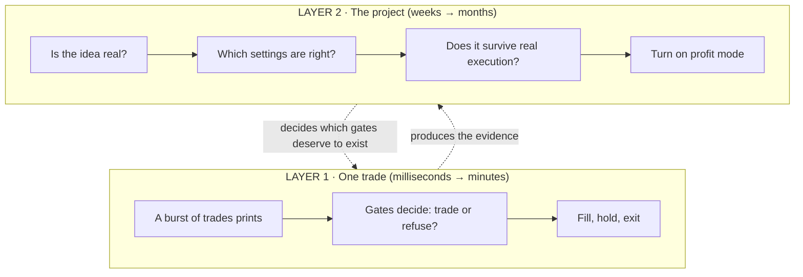
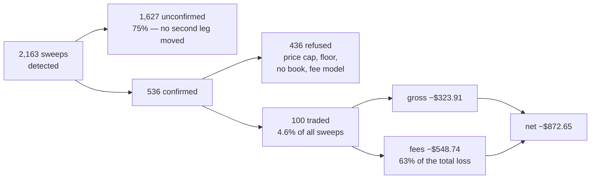

# Audit and decision plan

One document. It decides what the bot is for, whether the idea is real, whether the machine that
implements it is honest, and what each possible answer means for what happens next.

It exists because **every defect found between 2026-09-04 and 2026-09-07 was found incidentally,
while looking for something else** — eight for eight:

| Found | While looking for |
|---|---|
| Unbounded arrival queue fabricating $281 of profit | why the Inter–Napoli trades looked odd |
| The settlement card reading backwards | a question about Miami vs Atlanta |
| The consumer capped at 16 frames per event-loop turn | why the queue bound was dropping frames |
| Recovery amplifying its own failure | the same |
| The dashboard saying 88 when the gate fires at 80 | a question about the clock |
| `if not choices: continue` hiding the mapping state | a wrong claim about Liga MX coverage |
| Position size being a leftover, not a rule | a question about why sizes differ |
| Two MLS winners unreachable under today's config | a remark that MLS looked good |

That is not thoroughness. It is luck with a large surface area, and it means **the undiscovered
population is unknown** — every probe so far has returned something, which is the signature of a
population nowhere near exhausted.

---

## 0. The map

*This section explains the rest. Nothing here is new information — it is the same document, laid out
so it can be picked up cold, on any day, without remembering the previous conversation.*

### The whole thing in six sentences

1. The bot watches Kalshi soccer markets for **sweeps** — sudden bursts of trading in one direction —
   and bets that the price keeps moving that way for a minute or two afterwards.
2. That "keeps moving" is called **drift**, and whether it exists at all is the entire thesis. It has
   never been established.
3. After 12 days, 2,163 detected sweeps and 100 completed trades, the answer is **−$872.65 and a
   confidence interval containing zero** — meaning *we do not know*, not *it loses*.
4. The reason we cannot know is **variance**: results are spread so widely (σ = $61.32 per trade)
   that a real $5 edge would need 2,362 trades — about two years — to become visible.
5. The variance is **self-inflicted by the sizing rule**, not by the market, so it is fixable.
6. Meanwhile Kalshi will sell us ~1,000 past matches for free, and the detector reads *trades*, which
   those matches contain — so **the question can be answered in days by computer instead of years by
   waiting.** That is W0, and everything else waits behind it.

### Two layers, and why they get confused

Almost every confusion in this project comes from mixing these up. They are different questions.



**Layer 1 questions** sound like: *why didn't it trade that?* *why was the size different?* *why does
it say 88?* These are about the machine.

**Layer 2 questions** sound like: *is this even the right strategy?* *are these gates
overengineered?* *when can it be profitable?* These are about the project.

A Layer 1 answer can be completely correct and still worthless, because the gate it defends is
protecting a strategy that does not work. **That is why W0 runs first.** Auditing gates before
knowing whether the idea is real is polishing a machine that may not need to exist.

### Where things actually stand

Memorise nothing; this table is the scoreboard.



| | Number | What it means |
|---|---|---|
| Sweeps detected | 2,163 | The detector is not short of material |
| Reached a trade | 100 (4.6%) | The gates refuse ~95% of what is found |
| Net | −$872.65 | Paper money; no capital was ever at risk |
| Of which fees | $548.74 | **The fee load is larger than the trading loss** |
| Confidence interval | [−$24.32, +$6.27] | Contains zero → undecided, in both directions |
| σ per trade | $61.32 | The reason it is undecided |
| Second strategy (sleeve) | 365 signals, **0 trades ever** | 91% blocked by infrastructure, not by strategy |

The single most important line is the fees one. **Fees are 63% of the loss.** A strategy can have a
genuine edge and still lose money on this fee schedule — which is why W8 exists, and why it is the
workstream most likely to conclude that no gate change matters at all.

### The words that keep coming up

| Term | Plain meaning |
|---|---|
| **Gate A** | The sweep detector. The only strategy that has ever placed a trade |
| **The sleeve** | The second strategy (price-only late-score). 365 signals, never once traded |
| **Sweep** | A burst of trades pushing one contract in one direction within 150 ms |
| **Leg / contract** | One of the three outcomes — Home, Draw, Away. They sum to ~100¢ |
| **`dl`** | How far the price moved, on a scale where 2¢→4¢ counts as much as 50¢→67¢ |
| **Sibling confirmation** | A second leg moving the same way within ±50 ms. Real news moves more than one leg |
| **Drift** | Does the price keep going your way after you enter. **The entire thesis** |
| **σ (sigma)** | How spread out the results are. Large σ = noise drowns the signal |
| **Power / *n* needed** | How many trades before the noise cancels out and the truth shows |
| **Fill assumption** | What price you *assume* you got. Moved the same 29 trades from −$863 to +$550 |
| **`config_id`** | Fingerprint of the 47 settings + code. Different fingerprints cannot be pooled |
| **Round-trip fee** | ~3.5¢ per contract to get in and out near 50¢ |
| **Fixed-dollar sizing** | Always spend $100 — so a cheap contract buys 6× more of them. The variance culprit |
| **Book / depth / L2** | The resting orders waiting to be hit. The thing past trade data cannot show |
| **Taker / maker** | Hitting someone's order (pay the fee) vs resting your own (cheaper) |
| **K2** | The built-in kill condition on profitability. Currently **FAIL** |

### What is actually undecided — and it is yours, not an agent's

| Decision | The options | Recommendation | What would change it |
|---|---|---|---|
| **Study bot or profit bot?** | Tight gates protect money; wide gates gather information. It is currently built as the first and judged as the second | **Study** until an interval excludes zero | Nothing — this one is a preference, not a fact |
| **Run W0 before anything else?** | Backtest ~1,000 past matches now, or keep collecting live | **Run W0 first** | If the tape turns out not to contain what the detector needs — checkable in an afternoon |
| **Fixed contracts instead of fixed dollars?** | $100 per trade vs a fixed number of contracts | **Fixed contracts** — it cuts required sample by ~4× | Evidence that cheap contracts drift *more*, which would make the current bias deliberate |
| **Keep the 35¢ price floor?** | It was set to stop losses that were actually caused by sizing | **Delete it once sizing is fixed** — it discards half the sample to treat a symptom | If W0 shows cheap contracts genuinely do not drift |

If none of these is decided, the bot keeps running and keeps producing data that cannot settle
anything. **Deciding nothing is itself a decision, and it costs about two years.**

### How to check any answer — including mine

Every question below has a real mistake behind it, made during this investigation. You do not need
to read code to ask them, and asking them catches the error class without knowing the answer.

| Ask | The mistake it catches |
|---|---|
| **"Measured, or inferred?"** | SQLite was blamed for the latency. Replaying 120,000 real frames found 96 database statements total — 0.8% of the run |
| **"Over what window? Current or since-startup?"** | A cumulative average made a function look like a 13 ms problem. Measured over a live window it was 859 µs |
| **"Were the conditions the test needs actually present?"** | Two starvation checks reported *not discriminating* — the queue was never backed up while measured, so neither could conclude |
| **"Is that 'not measured', or 'measured and fine'?"** | The mapping bug hid in exactly that gap for weeks: zero looked like *no coverage*, it meant *never looked* |
| **"Which of the four is it — idea, threshold, implementation, or instrument?"** | A sizing defect was diagnosed as a price problem and fixed with a price floor. Still wrong today |
| **"What did you check and find *clean*?"** | A findings list cannot tell you whether 5 problems were found in 5 places or in 500. That is why a coverage ledger is mandatory |
| **"What would have proved you wrong?"** | "Liga MX has no clock coverage" survived until someone looked — Kalshi had a milestone for every single match |

The seventh is the strongest. An agent that cannot say what would have falsified its claim has not
tested anything; it has described its own reasoning back to you.

---

## 1. What is this bot for?

It serves two goals that pull in opposite directions, and has never been told which it is.

| | A profit bot wants | A study bot wants |
|---|---|---|
| Refusals | as many as possible — refusing is free | as few as possible — refusing costs information |
| Position size | as large as conviction allows | as small as measurement allows |
| Gates | tight, to protect capital | wide, to observe the population |
| Success | money | a number you can act on |

**It is built like the first and judged like the second.** That is the root of the recurring
confusion: every gate was added with profit logic, and every complaint about it is study logic.
Both are reasonable; they answer different questions, and nobody picked the question.

**Decision required, and it is the operator's.** The recommendation, stated plainly:

> **This is a study bot until it has an edge estimate whose confidence interval excludes zero.
> Profit is a later mode, switched on deliberately, not drifted into.**

Everything below assumes that answer.

---

## 2. Can the current setup ever decide? No.

Measured on the 95 clean closed trades (the 5 stale-book fills excluded):

```
mean net per trade   -$12.15
standard deviation    $61.32
95% interval         [-$24.48, +$0.19]
```

The interval contains zero. It also contains −$24. After 12 days of live trading the honest
statement is **"we do not know, in either direction"**.

| true edge per trade | trades needed | at ~100 trades/month |
|---|---:|---:|
| $2 | 14,759 | 147 months |
| $5 | 2,362 | **23.6 months** |
| $10 | 590 | 5.9 months |
| $20 | 148 | 1.5 months |

*(80% power, 95% two-sided, at the observed σ = $61.32.)*

An edge worth having is probably $2–$10 after fees. **At the current variance and trade rate that is
one to twelve years.** The project cannot reach a conclusion this way.

**The variance is self-inflicted.** σ = $61.32 on a $100 stake is the fixed-dollar sizing rule:
$100 buys 1,164 contracts at 8.6¢ and 173 at 57.9¢, so the payoff distribution is six times wider at
the cheap end. Required sample scales with σ² — **halving the standard deviation cuts the required
trades by four.** Fixed-contract sizing is therefore not a returns tweak; it is what makes the
experiment finishable. That is why it leads every change list.

---

## 3. What can be answered without waiting

Verified against the live Kalshi API on 2026-09-07:

```
1,776 settled markets across 10 of ~22 soccer series   = ~592 matches
extrapolated across all series                          ≈ 1,000+ matches
history reaches back to                                  2026-07-17 (7 weeks)

per trade: created_time (µs), yes_price_dollars, no_price_dollars,
           count_fp, taker_side, taker_outcome_side, trade_id
```

**The decisive fact: the detector consumes trades, not books.** `Detector.on_trade` takes prints,
so every admission test replays *exactly* — not approximated:

| Gate | Needs | Available historically? |
|---|---|---|
| `DL_MIN` — log-odds displacement | prices in the burst | **yes** |
| `LEVELS_MIN` — distinct price levels | prices in the burst | **yes** |
| `SIZE_MIN` — contracts | `count_fp` | **yes** |
| `CONF_MS` / `CONF_SIGN` — sibling confirmation | sibling prints, timestamps | **yes** |
| Post-event drift — *the candidate edge itself* | later prints | **yes** |

What the tape cannot give: order-book depth, spread, book mids, book age. So **Gate A is ~90%
backtestable; the price-only sleeve is largely not.**

**The fill objection is smaller than it looks.** A5c established that reconstructing fills from the
bot's own recorded books was worse than useless — the reconstructed ask was worse than a real
contemporaneous executed print in **29 of 29 cases, median +12¢**. A print at price P proves a trade
happened at P. The honest model is to price entries from executed prints and **report a range across
assumptions**, because the same 29 trades priced at −$863, −$229 or +$550 on that choice alone.

**So: no, you cannot one-shot a deployable config from prints** — execution reality is exactly what
prints omit, and that is where much of the loss lives. But you can compress **one to twelve years of
live discovery into days of computation**, and reach the live phase already knowing which questions
are worth spending real fills on.

| | Backtest (~1,000 matches, free, now) | Live bot (slow, expensive, real) |
|---|---|---|
| Does post-event drift exist? | **answer here** | confirm out of sample |
| At what horizon, how big? | **here** | confirm |
| Does the detector select for it? | **here** | confirm |
| Do the 47 parameters matter? | **here — sweep them** | fix the survivors |
| What do fills actually cost? | no | **only here** |
| What does latency cost? | no | **only here** |
| Do spreads permit entry after a goal? | no | **only here** |

The live bot stops being the instrument of discovery — which it is bad at — and becomes the
instrument of confirmation and execution realism, which is the only thing it is uniquely good at.

---

## 4. Rules of engagement

These are not general advice. Each has a corpse behind it from this investigation.

1. **Write the falsifier before the measurement.** Three wrong diagnoses this session (SQLite as the
   latency cause; Liga MX as a coverage gap; "widen the spread limit") came from reasoning one step
   past the last measurement.
2. **Deltas, never cumulative means.** A cumulative reading made `status()` look like a 13 ms
   regression when the windowed value was 859 µs.
3. **"Not measured" is not "measured and fine".** Different buckets, every output. The mapping bug
   was invisible precisely because these were conflated.
4. **A non-discriminating reading changes nothing.** If the conditions the test needs were not met,
   record that and stop.
5. **Record what was checked and found clean.** A findings list alone cannot distinguish coverage
   from a lucky probe. The coverage ledger is a required deliverable.
6. **Separate the four verdicts.** Every finding is exactly one of: *idea is wrong*, *threshold is
   wrong*, *implementation is wrong*, *instrument is wrong*. Conflating these is how a sizing defect
   became a price filter.
7. **No fixes during the audit.** Findings only. A fix mid-audit changes the thing being measured.

---

## 5. Workstreams

**W0 decides whether W1–W8 matter.** Run it first.

### W0 · Historical backtest — is the idea real at all?
**Question.** Across ~1,000 matches of Kalshi's own trade tape, does post-event price drift exist,
how large is it, at what horizon, and does the detector select for it?

**Method.** Pull every settled soccer market's trade tape (cursor-paginated, cached to disk). Feed
prints into the **existing `Detector` class** — the real one, not a reimplementation, so what is
tested is what production runs. For every candidate, measure forward movement at +5 s, +15 s, +30 s,
+60 s, +120 s, +300 s, priced from executed prints. Sweep the parameters that are computable from
prints. Report every result as a **range across fill assumptions**.

**Deliverable.** Drift magnitude and dispersion by horizon, by league, and by whether sibling
confirmation fired; plus a parameter sensitivity table.

**Acceptance.** A number for the drift, with an interval, robust or not robust to the fill
assumption — stated either way.

**Known trap.** A backtest that reports one number is lying. The same 29 trades priced at −$863,
−$229 or +$550 on the entry model alone.

**Blocked by nothing. Uses Kalshi's tape, so none of the bot's recording defects touch it.**

---

### W1 · Decision reconstructability
**Question.** For every outcome the system can record, can a decision be fully reconstructed from
stored fields alone — without the code, without inference?

**Method.** Enumerate the outcome vocabulary from `static/app.js` (`outcomeLabels`,
`clockGateLabels`) and `app/match_clock.py`. For each, find a real stored row. Attempt to answer,
from the row alone: what were the inputs, what was the threshold, why did this outcome and not a
neighbouring one, and what would have had to differ to flip it.

**Deliverable.** A table: outcome → example row id → reconstructable yes/no → missing fields.

**Acceptance.** Every outcome word either has a worked reconstruction or a named missing field.
Outcomes with **zero** stored examples are themselves a finding — dead code or an unreachable branch.

**Known trap.** Several outcomes have never fired. Absence of a row is a finding, not a gap in the
audit.

---

### W2 · Label ↔ reality sweep
**Question.** Does every number and word shown to a human match what the code actually does?

**Method.** Mechanical, exhaustive. Extract every user-facing string in `static/` and every log
message in `app/`. For each that names a number, a threshold, a direction or a unit, locate the code
it describes and compare. Include: axis labels, chip text, exit-reason wording, event-log lines,
tooltip copy, panel headings.

**Deliverable.** Table: string → file:line → what it claims → what the code does → match/drift.

**Acceptance.** Every string with a claim in it is checked. Drift is reported even when harmless.

**Known trap.** The two found so far were both *stale identifiers used as labels*: `clock_88_plus`
rendered as "88+" while the gate fires at 80, and a contract name printed beside a payout with the
side omitted. Look hardest where a stored identifier is displayed directly.

---

### W3 · Silent-failure sweep
**Question.** Where can the system decline to tell you something?

**Method.** Enumerate all 37 `except … pass`, all 66 bare `continue`, every `.get(k, default)` and
`or 0` on a decision path, and every unbounded collection (list, dict, deque, queue) that grows from
external input. For each: what is swallowed, is it counted, is it recoverable after the fact.

**Deliverable.** Table: site → what it swallows → counted? → ledgered? → verdict (justified /
should count / should fail loudly).

**Acceptance.** Every site classified. Every unbounded collection either bounded, or documented with
the argument for why it cannot grow without limit.

**Known trap.** The unbounded arrival queue was *deliberate and documented* and still catastrophic.
"There is a comment explaining it" is not a passing verdict — the question is what happens at the
limit.

---

### W4 · Parameter provenance
**Question.** For each of the 47 strategy parameters: what evidence set this value, how large was
the sample, and does that evidence still exist?

**Method.** For each name in `STRATEGY_PARAM_NAMES`, find its introducing change-log entry. Record
the value, the justification, the sample size, and whether the analysis is reproducible from data
still on disk. Flag any parameter whose justification cites a sample smaller than 30, or cites data
from a superseded `config_id` era, or cannot be traced at all.

**Deliverable.** One row per parameter: value → origin → sample n → reproducible? → verdict
(evidence-backed / underpowered / untraceable / inherited default).

**Acceptance.** All 47 classified. Expect most to land in "underpowered" — that is the finding, and
its size is the point.

**Known trap.** `PRICE_FLOOR` was set on 27 trades and its own comment correctly identifies the
mechanism as *sizing* while the parameter controls *price*. Check whether the stated mechanism and
the controlled variable are the same variable. This is likely not the only case.

---

### W5 · Derived-not-designed behaviour
**Question.** What does the bot do that nobody decided?

**Method.** Walk the trade lifecycle and, at each step, ask whether the behaviour is *configured* or
*emergent from the interaction of two other rules*. Position size is the known instance: it is
whatever `$100` buys after walking a ladder to a price cap, so it is jointly determined by
`NOTIONAL_USD`, `PRICE_CAP` and the book's depth, and is not itself a parameter.

**Deliverable.** List of emergent behaviours, with the rules that produce each, and whether the
result was ever stated as an intent anywhere.

**Acceptance.** Entry size, exit size, hold time, re-entry behaviour, per-market exposure and
concurrent-position count each classified as designed or emergent.

**Known trap.** Emergent behaviour is invisible in config review, because there is no knob to read.
It only appears when you ask "what determines this number?" of an *observed* value.

---

### W6 · Measurement validity
**Question.** Is the instrumentation telling the truth, and what does it cost?

**Method.** For every number on `/api/status`, `/api/stats`, `/api/latency` and the dashboard:
what window does it cover, is it cumulative or windowed, what does it exclude, and what does
computing it cost the event loop. Re-derive a sample of them independently from the raw tables.

**Deliverable.** Per metric: definition → window → known exclusions → independently reproduced?
→ cost to compute.

**Acceptance.** Every displayed metric has a stated window. Any metric whose displayed value cannot
be reproduced from stored data is a finding.

**Known trap.** Part E of the investigation: every instrumentation layer added since 2026-08-30 ran
on the trading loop and *became* the latency it was added to explain. Measure the cost of each
measurement, not only its value.

---

### W7 · Data trustworthiness manifest
**Question.** Which time windows are usable for which claims?

**Method.** Build a calendar of the recorded history marking: `config_id` era boundaries, known
incidents (the 05:16–05:45 mapping window, the stale-book window, the firehose era before
2026-08-27 22:14), feed gaps and reconnects from `feed_events`, and stale-book fills from
`entry_context`. Then state, per window, which analyses it can and cannot support.

**Deliverable.** A manifest table other workstreams cite before making any statistical claim.

**Acceptance.** Every closed trade falls in exactly one window with a stated usability verdict.

**Known trap.** The L2 replay showed the same 29 trades pricing from −$863 to +$550 on the entry
model alone. A window being *recorded* does not make it *usable*; the book-correctness test from
A5c is the gate.

**This workstream blocks W8 and any statistical claim in any other workstream.**

---

### W8 · Economic model
**Question.** Independent of signal quality, do the mechanics permit profit?

**Method.** Decompose the 100 closed trades into signal edge, fee cost, spread cost and sizing
effect. Fees are $548.74 against a gross trading loss of $323.91 — establish what gross edge per
trade would be required to overcome the current fee load, and whether any observed subset achieves
it. Model the same trades under: fixed-contract sizing, maker-side entry, and shorter holds.

**Deliverable.** A break-even statement — the edge required, in cents per contract, for the current
fee and sizing model to be viable — and whether anything in the record clears it.

**Acceptance.** A number an operator can hold every future strategy proposal against.

**Known trap.** This is the workstream most likely to conclude that no gate change matters, because
the fee load dominates. That is a legitimate and important result. Do not soften it.

---

## 6. Sequencing

```
W0 (backtest) ──> decides whether the rest is worth running at all
                  │
                  ├─ idea real ──> W1–W8 proceed, then live confirmation
                  └─ idea dead ──> stop; only W8 (economics) still informative

W7 (data manifest) ──┬──> W8 (economics)
                     └──> any statistical claim in W1–W6

W2, W3, W4, W5 ──> independent, run in parallel, no data dependency
W6 ──> before re-measuring anything performance-related
```

Run **W0 first**, alone. Then **W7**. Then **W2, W3, W4, W5 in parallel** — code-reading work needing
no live data. **W1 and W6** need a running system. **W8 last**, depending on W7's verdict and W5's
sizing analysis.

---

## 7. Decision gates

Pre-registered, so the answer cannot be negotiated after the fact.

### From W0 — these decide everything

| Result | Verdict | Audit | Bot |
|---|---|---|---|
| Drift ≥ 2× round-trip fee, across ≥ 3 leagues, robust to fill assumption | Idea sound | Run W1–W8 in full | Re-derive parameters from W0, then live confirmation |
| Drift exists but < round-trip fee | Idea real, economics dead | Run W8 only | Attack fees (maker entry) or stop |
| Drift only under the most favourable fill assumption | Not established | Pause | Do not deploy; fix method first |
| **No drift at any horizon across 1,000 matches** | **The idea is wrong** | **Stop — do not audit gates on a dead strategy** | Stop. Do not tune |
| Confirmation does not select for drift | Confirmation is not an admission rule | Note in W4 | Demote to a recorded label |

> **If W0 says the idea is wrong, that is a successful outcome.** It costs days instead of years and
> is the single highest-value result available right now. The failure mode to avoid is spending
> another twelve months of live collection to learn the same thing.

### From the integrity workstreams

| Result | Meaning | Action |
|---|---|---|
| W4: most parameters underpowered | The config is fitted to noise | Re-derive from W0; delete what has no effect |
| W7: most live history unusable | Live evidence is thinner than the trade count suggests | Weight W0 higher still |
| W8: required edge exceeds anything observed | Mechanics forbid profit regardless of signal | Fee model first, or stop |
| W3: silent-failure sites on decision paths | Unknown behaviour remains | Fix before any live confirmation run |

---

## 8. Staged plan

**Stage 0 — W0 backtest.** Blocked by nothing. Start here.

**Stage 1 — re-derive parameters** from ~1,000 matches instead of tens of trades. Expect deletions;
47 parameters will not survive contact with real power.

**Stage 2 — live confirmation mode.** Reconfigure the bot as a measurement instrument: **fixed
contracts, small**; gates wide, keeping only what W0 justified; every episode recorded. Purpose:
confirm out of sample, and measure the four things prints cannot show — fill quality, latency cost,
post-goal spread reality, and fee load in practice. **Requires W7 complete.**

**Stage 3 — profit mode.** Only after Stage 2's interval excludes zero *and* W8's fee model closes.
A deliberate switch, with sizing and exposure chosen on purpose.

---

## 9. Running it with Fable

**One workstream per agent session.** They share no state; a shared session pollutes each with the
others' priors, which is exactly how the incidental-finding pattern started.

**Effort calibration:**

| Workstream | Effort | Why |
|---|---|---|
| W3, W4, W5 | high | Judgement-heavy; the finding *is* the reasoning |
| W1, W2, W6 | medium | Largely enumerable; volume over subtlety |
| W7 | high | Every downstream claim rests on it |
| W8 | high | Modelling choices dominate the answer (see A5c) |

**Fresh agents, deliberately.** I have already formed views on the price floor, sibling confirmation
and the sizing rule. For W4 and W5 in particular, an agent with no exposure to this conversation is
worth more than one briefed on my conclusions — if it reaches the same findings independently, that
is evidence; if it is told them, that is nothing.

**Required output schema.** Every finding, in every workstream:

```
id:            W4-011
class:         idea | threshold | implementation | instrument
claim:         one sentence, falsifiable
evidence:      file:line, or query + result, or measurement + window
falsifier:     what would have shown this to be wrong
confidence:    established | supported | directional | speculative
cost if true:  what it breaks or what it costs, concretely
fix:           proposed change, or "none — record only"
```

**Required coverage ledger.** Separate file, per workstream:

```
checked:       what was examined
clean:         examined and found correct  ← the part that makes the audit worth anything
findings:      ids raised
not reached:   what was in scope and not examined, and why
```

Without the ledger you cannot distinguish *"we checked 47 parameters and 40 are fine"* from
*"we found 7 problems"*. Only the first tells you whether to keep auditing.

---

## 10. What not to do

- **Do not fix anything during the audit.** Findings only.
- **Do not run W1–W8 before W0.** Auditing the gates of a dead strategy is wasted effort.
- **Do not pool data across `config_id` eras** without W7's explicit clearance.
- **Do not accept "there is a comment explaining it"** as a passing verdict in W3.
- **Do not report a cumulative mean** as a current rate anywhere.
- **Do not report a single backtest number.** Range across fill assumptions, or it is not a result.
- **Do not let an agent conclude from a non-discriminating measurement.**
- **Do not skip the coverage ledger** because the findings list looks productive.

---

## 11. What this will probably conclude

Stated in advance, so it can be contradicted rather than confirmed:

1. Most of the 47 parameters are underpowered — fitted on samples of tens.
2. The fee load requires an edge larger than anything in the record.
3. Several more label/reality drifts exist, in the same place: identifiers used as labels.
4. More silent-failure sites exist on paths that matter.
5. The sleeve's entry conditions are jointly unsatisfiable near a goal, not merely strict.
6. Post-event drift is real but smaller than the round-trip fee.

If it returns these six and nothing else, it has under-delivered — the whole premise is that the
unknown population is larger than the known one.
